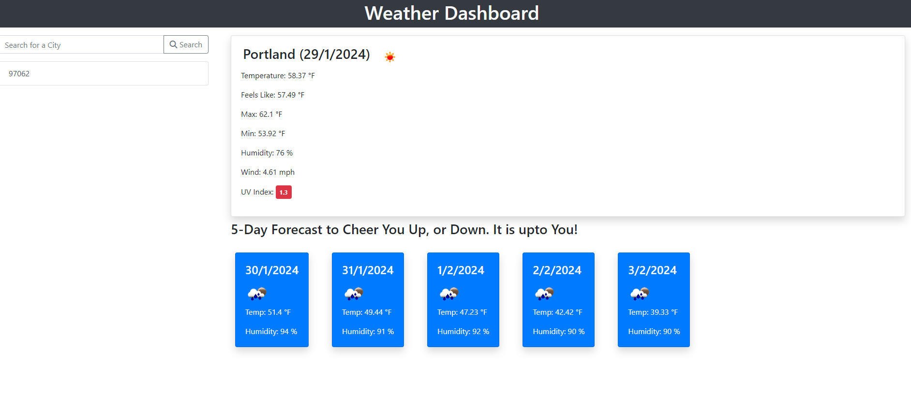

# Challenge05-Weather-teller

# Weather App

This is a simple weather app that provides real-time weather information for your locations.

## Features

- Provides Max And Low Tems
- Humidity Levels
- Provides Wind Levels
- UV Index for sun radiation

## Installation

To install the weather app, follow these steps:

1. Just open the following link in your browser or clone the repository
2. https://github.com/Wormhole616/Challenge05-Weather-teller

## Usage

To use the weather app, simply open it in your web browser. The app will automatically detect your location and provide real-time weather updates.

## Screenshots of deployed Site

## License

This project is licensed under the MIT License - see the LICENSE file for details.
